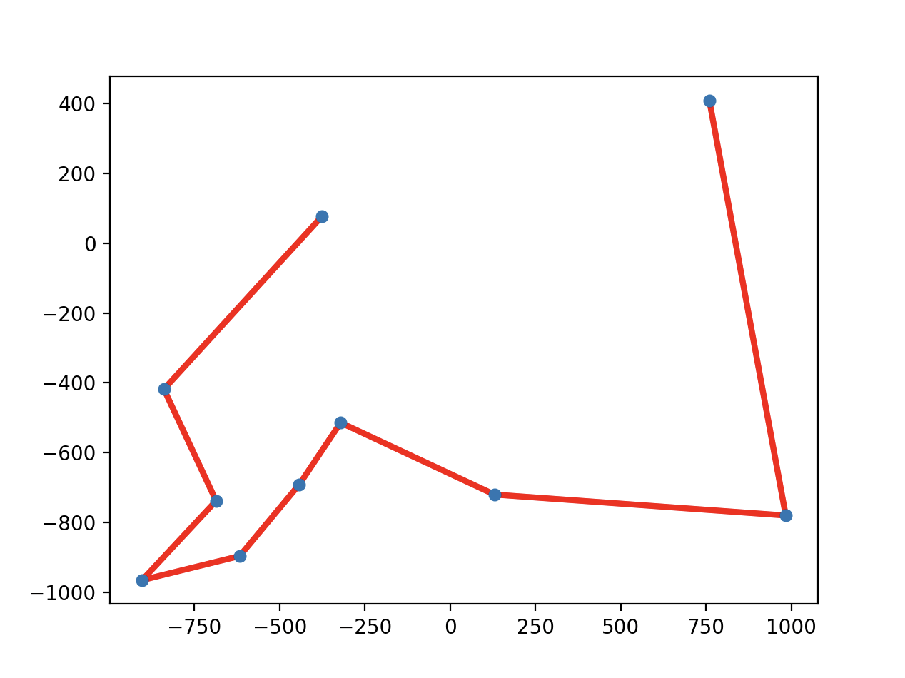

# Genetic algorithm

## Problem
https://en.wikipedia.org/wiki/Travelling_salesman_problem

## Usage
`python main.py {nums} {precision}`

* nums - number of generated points
* precision - how accurate the algorithm is supposed to be

Example usage:
`python main.py 10 10`